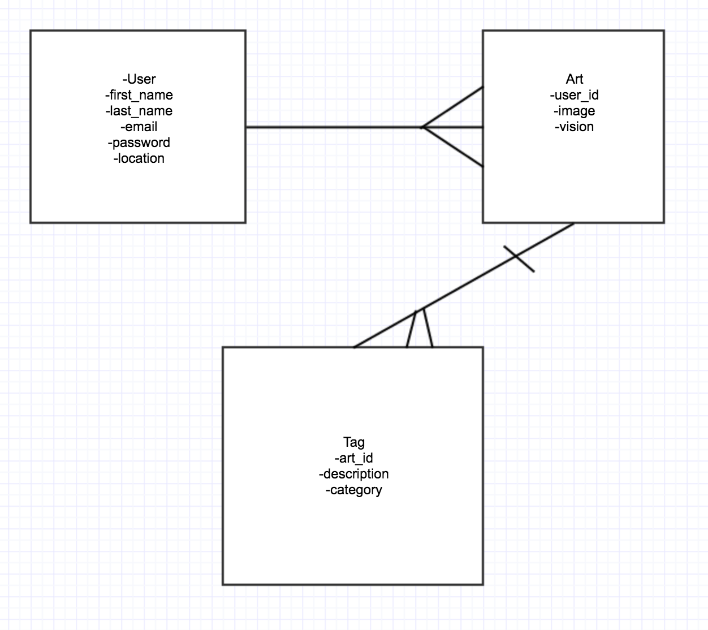

# Tag-Team

### Overview

Tag isn't just a social sharing web app, it's a culture of street art lovers and artists using the streets as their canvas.

With the implementation of the Google Vision API you can search through our database of images using key word tags to match your query.

---

### Browser Compatibility

* Tested in Chrome and Safari.

---

### Work flow

1. Ideation
2. Planning, Deliverables and Proposal

* User Stories

* ERD

* Sketch

* Wireframe

* Project Schedule

* Project Trello Board: (https://trello.com/b/CyvUVlj1/tag-team)

3. Project Presenation and Approval
4. Online Research for Project
5. Execution

### Tools Set-Up
1. Sketch
2. Trello
3. Atom/Sublime
4. Materialize
5. Chrome Tools
---

### Technologies Used

1. HTML
2. CSS
3. Ruby
4. Rails
5. Active Record
6. Postgresql/SQLite
7. Google Vision API

### Documentation

1. Materialize (http://materializecss.com/)
2. Rails (http://guides.rubyonrails.org/)
3. Active Record (http://guides.rubyonrails.org/active_record_basics.html)
4. Ruby (http://ruby-doc.org/)
5. Postgresql (https://www.postgresql.org/)
6. Google Vision API (https://cloud.google.com/vision/)

---

### Challenges

* Wanted to add social share and follow buttons. Future goal.

* To avoid Github conflicts, essentially slowly us down, we did our best to pair on most work and only push up from those computers.

* Implementing and Executing API

### Shout Out...

Ryan Rusnak out in SD for his feeback on the Google Vision API.
Ryan's Github: https://github.com/RyanRusnak

To Our Classmates and TAs for Their Support and Contributions
### ERD

### Wireframe

### Home Page

### Sign-Up Page

### All Street Art Page

### Post New Street Art Page

### User Profile Show Page
